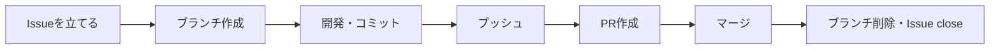

# 開発ガイドライン

> このドキュメントは、このリポジトリで開発を行う際の運用ルールをまとめたものです。
> `main` ブランチは保護されており、直接プッシュはできません（[GitHub側の保護設定](#4-github側の保護設定)を参照）。すべての変更は Issue → ブランチ → Pull Request（以下 PR）の流れで行ってください。

## 目次

1. [開発の流れ](#1-開発の流れ)
2. [ブランチ運用](#2-ブランチ運用)
3. [Pull Requestの作成とマージ](#3-pull-requestの作成とマージ)
4. [GitHub側の保護設定](#4-github側の保護設定)

---

## 1. 開発の流れ

開発は必ず次の順序で進めます。

1. **Issueを立てる** — 開発に着手する前に、必ず Issue を作成します（「何を」「なぜ」やるかを明確にするため）
2. **ブランチを作成する** — 作成した Issue の番号を含むブランチを、`main` から切ります
3. **開発してコミットする** — 変更内容が分かるメッセージでコミットします
4. **プッシュする** — 作業ブランチをリモートに push します
5. **PRを作成する** — `main` へ向けて PR を作成し、本文に対応する Issue 番号を記載します
6. **マージする** — PR をマージします（`main` への直接 push はできません）
7. **後片付けする** — マージ後、リモート・ローカル両方の作業ブランチを削除します。Issue は PR のマージに連動して自動的に close されます



---

## 2. ブランチ運用

### 2.1 ブランチ命名規則

```
feature/<issue番号>-<内容を表す短い英語>
```

**Issue番号を必ず含めてください。** ブランチと Issue の対応が一目で分かるようにするためです。

| 例 | 説明 |
| --- | --- |
| `feature/10-github-workflow` | Issue #10「GitHub運用ルールの確立」に対応するブランチ |
| `feature/12-task-read-api` | Issue #12 に対応する、タスク取得APIのブランチ |

> バグ修正など性質が異なる場合は `fix/<issue番号>-<内容>` のように接頭辞を変えても構いません。番号を含める点は変わりません。

### 2.2 `main` ブランチについて

`main` へは直接コミット・pushできません（[GitHub側の保護設定](#4-github側の保護設定)参照）。変更は必ず PR 経由で取り込みます。

---

## 3. Pull Requestの作成とマージ

- PR本文には、対応する Issue 番号を **`Closes #<issue番号>`** の形式で必ず記載してください。マージ時に Issue が自動的に close されます
- レビュー承認は必須にしていません（現状 1人開発のため）。ただし `main` への統合は必ず PR を経由します
- **PRの作成者はマージを実行しません。** 内容を確認した人（リポジトリ管理者）が手動でマージしてください。Claude Codeなどのツールを使ってPRを作成した場合も同様に、マージは行わずユーザーの確認を待ちます
- **マージ方式は「マージコミット」を使ってください。** Squash・Rebaseは使いません（コミット履歴とPR単位の対応を保つため）。GitHub側でもマージコミット以外は選択できないよう設定済みです
- マージ後は、リモートブランチが自動削除されるよう設定済みです
- マージ後、ローカルの作業ブランチも削除してください

```bash
# mainを最新化してブランチを作成
git switch main
git pull
git switch -c feature/<issue番号>-<内容>

# 開発・コミット・プッシュ
git add <ファイル>
git commit -m "<変更内容が分かるメッセージ>"
git push -u origin feature/<issue番号>-<内容>

# PR作成（本文に Closes #<issue番号> を含める）
gh pr create --fill
```

**ここでPRの内容を確認し、問題なければマージします。**

```bash
# マージ（マージコミット方式・リモートブランチも同時に削除）
gh pr merge --merge --delete-branch

# ローカルの後片付け
git switch main
git pull
git branch -d feature/<issue番号>-<内容>
```

---

## 4. GitHub側の保護設定

`main` ブランチには Repository Ruleset により、以下が設定されています。

| ルール | 内容 |
| --- | --- |
| PR必須 | `main` への変更はPR経由のみ可能（直接pushは拒否される） |
| マージ方式はマージコミットのみ | Squash・Rebaseマージは選択不可 |
| force push禁止 | 履歴の書き換えを防止 |
| ブランチ削除禁止 | `main` 自体の削除を防止 |
| マージ後の自動削除 | PRマージ時、リモートの作業ブランチを自動削除 |

管理者を含め、誰も `main` へ直接pushすることはできません。緊急時も、必ずPRを経由してください。
