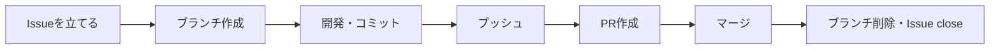

# 開発ガイドライン

> このドキュメントは、このリポジトリで開発を行う際の運用ルールをまとめたものです。
> `main` ブランチは保護されており、直接プッシュはできません（[GitHub側の保護設定](#5-github側の保護設定)を参照）。すべての変更は Issue → ブランチ → Pull Request（以下 PR）の流れで行ってください。

## 目次

1. [開発の流れ](#1-開発の流れ)
2. [ブランチ運用](#2-ブランチ運用)
3. [コミットメッセージ規約](#3-コミットメッセージ規約)
4. [Pull Requestの作成とマージ](#4-pull-requestの作成とマージ)
5. [GitHub側の保護設定](#5-github側の保護設定)

---

## 1. 開発の流れ

開発は必ず次の順序で進めます。

1. **Issueを立てる** — 開発に着手する前に、必ず Issue を作成します（「何を」「なぜ」やるかを明確にするため）
2. **ブランチを作成する** — 作成した Issue の番号を含むブランチを、`main` から切ります
3. **開発してコミットする** — [コミットメッセージ規約](#3-コミットメッセージ規約)に沿ってコミットします
4. **プッシュする** — 作業ブランチをリモートに push します
5. **PRを作成する** — `main` へ向けて PR を作成し、本文に対応する Issue 番号を記載します
6. **マージする** — PR をマージします（`main` への直接 push はできません）
7. **後片付けする** — マージ後、リモート・ローカル両方の作業ブランチを削除します。Issue は PR のマージに連動して自動的に close されます



---

## 2. ブランチ運用

### 2.1 ブランチ命名規則

```
feature/<issue番号>-<内容を表す短い英語>
```

**Issue番号を必ず含めてください。** ブランチと Issue の対応が一目で分かるようにするためです。

| 例 | 説明 |
| --- | --- |
| `feature/10-github-workflow` | Issue #10「GitHub運用ルールの確立」に対応するブランチ |
| `feature/12-task-read-api` | Issue #12 に対応する、タスク取得APIのブランチ |

> バグ修正など性質が異なる場合は `fix/<issue番号>-<内容>` のように接頭辞を変えても構いません。番号を含める点は変わりません。

### 2.2 `main` ブランチについて

`main` へは直接コミット・pushできません（[GitHub側の保護設定](#5-github側の保護設定)参照）。変更は必ず PR 経由で取り込みます。

---

## 3. コミットメッセージ規約

このプロジェクトでは、以下の形式でコミットメッセージを書きます。

```
初級編<回> 【<カテゴリ>】<その回のテーマ>: <このコミットでの詳細>
```

| 要素 | 説明 | 例 |
| --- | --- | --- |
| `<回>` | RaiseTech講座の回数 | `初級編9`, `初級編10` |
| `<カテゴリ>` | 作業の種類 | `【要件定義】` `【設計】` `【実装】` |
| `<その回のテーマ>` | その回全体のお題 | `DB構築と接続` |
| `<詳細>` | このコミット固有の変更内容 | `DB GUI(CloudBeaver)を追加しdbを内部化` |

**実例:**

```
初級編9 【実装】DB構築と接続: DB GUI(CloudBeaver)を追加しdbを内部化
初級編7 【設計】プロトタイプ作成: HTML/CSS/JSモックを追加
初級編5 【要件定義】何を作るかAIと決める: Trello調査・要件定義書・プロンプトログを追加
```

同じ回・同じテーマの中で複数コミットする場合、`<回>【カテゴリ】<テーマ>:` の部分は揃え、`<詳細>` だけを変えていきます。

---

## 4. Pull Requestの作成とマージ

- PR本文には、対応する Issue 番号を **`Closes #<issue番号>`** の形式で必ず記載してください。マージ時に Issue が自動的に close されます
- レビュー承認は必須にしていません（現状 1人開発のため）。ただし `main` への統合は必ず PR を経由します
- マージ後は、リモートブランチが自動削除されるよう設定済みです（`gh pr merge --delete-branch` を使うか、GitHub側の自動削除設定に任せてください）
- マージ後、ローカルの作業ブランチも削除してください

```bash
# mainを最新化してブランチを作成
git switch main
git pull
git switch -c feature/<issue番号>-<内容>

# 開発・コミット・プッシュ
git add <ファイル>
git commit -m "初級編N 【カテゴリ】テーマ: 詳細"
git push -u origin feature/<issue番号>-<内容>

# PR作成（本文に Closes #<issue番号> を含める）
gh pr create --fill

# マージ（リモートブランチも同時に削除）
gh pr merge --squash --delete-branch

# ローカルの後片付け
git switch main
git pull
git branch -d feature/<issue番号>-<内容>
```

---

## 5. GitHub側の保護設定

`main` ブランチには Repository Ruleset により、以下が設定されています。

| ルール | 内容 |
| --- | --- |
| PR必須 | `main` への変更はPR経由のみ可能（直接pushは拒否される） |
| force push禁止 | 履歴の書き換えを防止 |
| ブランチ削除禁止 | `main` 自体の削除を防止 |
| マージ後の自動削除 | PRマージ時、リモートの作業ブランチを自動削除 |

管理者を含め、誰も `main` へ直接pushすることはできません。緊急時も、必ずPRを経由してください。
