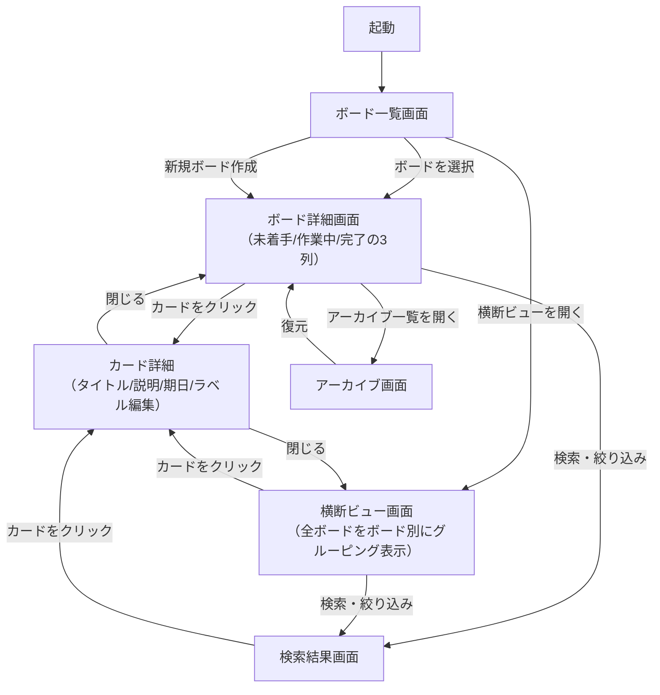
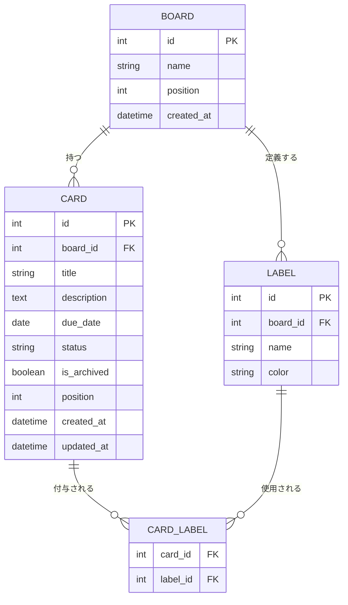

# タスク管理アプリ 要件定義書

> このドキュメントは、[`docs/trello-research.md`](./trello-research.md)（Trello 事前調査）を土台に、個人利用向けに機能を絞り込んで設計した、オリジナルのタスク管理アプリの要件定義書です。
> 開発が初めての方でも理解できるように、専門用語には補足を添えています。

## 目次

1. [はじめに](#1-はじめに)
2. [アプリ概要](#2-アプリ概要)
3. [スコープ定義](#3-スコープ定義)
4. [用語集](#4-用語集)
5. [機能要件](#5-機能要件)
6. [画面構成と画面遷移](#6-画面構成と画面遷移)
7. [データモデル](#7-データモデル)
8. [非機能要件](#8-非機能要件)
9. [技術スタック案](#9-技術スタック案)
10. [今後の拡張ロードマップ](#10-今後の拡張ロードマップ)

---

## 1. はじめに

### 1.1 本書の目的

本プロジェクトでは、Trello を参考にしつつも、個人利用に特化したオリジナルのタスク管理アプリを開発します。
Trello は非常に多機能ですが、個人（1人）で使う分には不要な機能（メンバー招待、権限管理、外部連携など）が数多く含まれています。
そこで本書では、「本当に必要な機能」だけに絞り込んだ上で、開発に着手できるレベルまで仕様を具体化することを目的としています。

### 1.2 本書の位置づけ

`trello-research.md` が「Trello にはどんな機能があるか」を調査した資料であるのに対し、本書 `requirements.md` は、その調査結果とユーザーへのヒアリングをもとに「このアプリでは何を作るか」を確定させた**設計の出発点**となる資料です。今後の画面設計・DB設計・実装は、すべて本書の内容をベースに進めます。

### 1.3 本書の読み方

- **2章**：アプリ全体のコンセプトを掴む章です。
- **3章**：「作る機能」と「作らない機能」の線引きを明記した章です。開発中に機能追加の要望が出た際は、まずこの章に立ち返ってスコープ内かどうかを確認してください。
- **4章**：本書内で使う用語の定義集です。
- **5章**：各機能の詳細仕様と、実装が完了したと判断するための受け入れ条件（Acceptance Criteria）をまとめています。実装時のチェックリストとして使えます。
- **6〜7章**：画面構成とデータベース構造（データモデル）を図解しています。
- **8〜9章**：性能・保守性などの非機能要件と、技術選定の候補案です。
- **10章**：今回のスコープには含めなかったが、将来追加を検討する機能の一覧です。

---

## 2. アプリ概要

### 2.1 コンセプト

**「仕事とプライベートのタスクを、1人で・シンプルに・俯瞰しながら管理できるアプリ」**

Trello のカンバン方式（ボード・カードでタスクを視覚的に管理する考え方）の使いやすさを踏襲しつつ、個人利用では使わない機能を削ぎ落とし、代わりに「複数のボードを横断して今日やることを一目で把握できる」独自機能を備えます。

### 2.2 想定ユーザー

- 利用者は**自分ひとり**（単一ユーザー）。チームでの共同作業やメンバー招待は想定しません。
- 仕事の業務タスクと、プライベートの ToDo（家事・買い物・手続きなど）を**同じアプリの中で**、ボードを分けて管理したい人。

### 2.3 利用シーン（例）

- 朝、アプリを開いて「横断ビュー」で仕事・プライベート問わず今日やるべきことを俯瞰する。
- 仕事中は「仕事」ボードだけを表示し、業務タスクを未着手→作業中→完了とドラッグして進める。
- 週末に「家事」ボードを開き、たまっている ToDo にラベルを付けて優先度を整理する。
- 完了したタスクは自動でアーカイブに退避され、ボードがすっきりした状態を保てる。

### 2.4 Trello との違い（設計方針）

| 観点                    | Trello                                                   | 本アプリ                                                        |
| ----------------------- | -------------------------------------------------------- | --------------------------------------------------------------- |
| 対象ユーザー            | 個人〜大人数のチーム                                     | 個人（単一ユーザー、**認証なし**）                        |
| リスト（列）構成        | ボードごとに自由に作成・命名可能                         | **「未着手 / 作業中 / 完了」の3列に固定**（全ボード共通） |
| 複数ボードの横断閲覧    | 標準機能としては無い（上位プランのダッシュボードが近い） | **標準機能として搭載**（横断マージビュー）                |
| メンバー・権限管理      | あり                                                     | なし                                                            |
| 拡張機能（Power-Ups等） | 250種類以上                                              | なし（必要性が生じた際に個別検討）                              |

> **なぜリストを3列に固定するのか？**
> 本アプリの目玉機能である「複数ボードの横断マージビュー」では、全ボードのカードを1画面に集めて表示します。もしボードごとに自由なリスト名（例：「レビュー待ち」「保留」「テスト中」など）を許容すると、横断表示した際に**似た役割のリストが別名で乱立し、状態の比較がしづらくなります**。そのため、あえてリスト（ステータス）を「未着手 / 作業中 / 完了」の3つに固定し、どのボードでも同じ意味の列として扱えるようにしています。

---

## 3. スコープ定義

### 3.1 採用する機能（MVPスコープ）

| カテゴリ | 機能             | 概要                                                       |
| -------- | ---------------- | ---------------------------------------------------------- |
| ボード   | ボード管理       | ボードの作成・名称変更・削除・切り替え表示                 |
| 横断表示 | 横断マージビュー | 全ボードのカードをボード別にグルーピングして一覧表示       |
| カード   | カード管理       | タイトル・説明・期日・ラベルを持つカードの作成・編集・削除 |
| カード   | ステータス変更   | ドラッグ＆ドロップで「未着手/作業中/完了」間をカード移動   |
| 分類     | ラベル           | 既定カラーパレットから選び、任意の名前を付けて分類         |
| 期日     | 期日の強調表示   | 期限切れ・期限間近のカードを画面上で色分け                 |
| 整理     | アーカイブ       | 完了カードを削除せず退避し、一覧から確認・復元できる       |
| 検索     | 検索・絞り込み   | キーワードとラベルでカードを絞り込む                       |

### 3.2 スコープ外の機能（今回は実装しない）

以下は Trello 調査（`trello-research.md`）で確認した機能のうち、個人利用のMVPには不要と判断し、今回は実装しないものです。将来的な拡張候補として [10章](#10-今後の拡張ロードマップ) に整理しています。

| 機能                                   | スコープ外とする理由                                                               |
| -------------------------------------- | ---------------------------------------------------------------------------------- |
| チェックリスト（サブタスク）           | まずはカード単位の管理で十分なため                                                 |
| 担当者・メンバー招待                   | 単一ユーザー利用のため不要                                                         |
| コメント機能                           | 他者とのやり取りが発生しないため不要                                               |
| 添付ファイル・カバー画像               | MVPの必須要件ではないため                                                          |
| リアルタイム同期（WebSocket）          | 同時に複数人・複数端末から編集する状況を想定しないため                             |
| プッシュ通知・メール通知               | 画面上の強調表示で代替するため                                                     |
| テンプレート機能                       | ボード数が少ない個人利用では優先度が低いため                                       |
| 自動化（Butlerのようなルール機能）     | 運用が複雑になるため、まずは手動操作で十分                                         |
| カレンダー・タイムライン等の複数ビュー | 横断マージビューで代替できるため                                                   |
| Power-Ups（外部連携）                  | 個人利用では連携先が少ないため                                                     |
| 権限管理                               | 単一ユーザーのため不要                                                             |
| リストの自由な作成・改名・削除         | 「未着手/作業中/完了」の3列固定方針のため（[2.4](#24-trello-との違い設計方針)参照） |
| スマートフォン最適化                   | PC中心の利用を前提とするため（[8章](#8-非機能要件)参照）                            |

---

## 4. 用語集

| 用語                                | 意味                                                                                            |
| ----------------------------------- | ----------------------------------------------------------------------------------------------- |
| **ボード（Board）**           | プロジェクトや領域（例：仕事、家事）単位の作業スペース。本アプリでは複数作成できる              |
| **カード（Card）**            | 個々のタスクを表す最小単位。タイトル・説明・期日・ラベル・ステータスを持つ                      |
| **ステータス**                | カードの進捗状態。本アプリでは「未着手」「作業中」「完了」の3種類に固定                         |
| **ラベル**                    | カードに付ける色付きのタグ。分類や優先度の目印として使う                                        |
| **アーカイブ**                | 完了したカードを削除せずに非表示化し、一覧から後で確認できる状態にすること                      |
| **横断マージビュー**          | 全ボードのカードを1画面に集約し、ボードごとにグルーピングして表示する本アプリ独自の画面         |
| **ドラッグ＆ドロップ（D&D）** | マウスでカードをつかみ、別の場所（ステータス列）へ移動させる操作方法                            |
| **CRUD**                      | Create（作成）・Read（閲覧）・Update（更新）・Delete（削除）の頭文字。データ操作の基本4種を指す |

---

## 5. 機能要件

各機能について、概要・詳細仕様・受け入れ条件（実装完了の判断基準）をまとめます。

### 5.1 ボード管理

**概要**：タスクを分類する入れ物である「ボード」を作成・管理する機能。

**詳細仕様**

- ボードは複数作成できる（例：「仕事」「家事」など、用途ごとに分ける）。
- ボードには名前を設定できる。
- ボード一覧画面から、表示するボードを切り替えられる。
- ボードの名称変更・削除ができる（削除時は所属するカードも削除される旨を確認する）。
- ボードの表示順を並べ替えられる。

**受け入れ条件**

- [ ] ボードを新規作成すると、一覧に追加され、中身が空の状態（3列とも0件）で表示される
- [ ] ボード名を変更すると、一覧・詳細画面・横断ビューすべてに反映される
- [ ] ボードを削除すると、確認ダイアログが表示され、承認後に所属カードごと削除される
- [ ] 複数ボードが存在する状態で、一覧から任意のボードへ切り替えられる

### 5.2 カード管理

**概要**：タスクの実体である「カード」を作成・編集・削除する機能。

**詳細仕様**

- カードは以下の属性を持つ。
  - タイトル（必須）
  - 説明・メモ（任意、自由記述）
  - 期日（任意）
  - ラベル（任意、複数付与可）
  - ステータス（未着手／作業中／完了、初期値は「未着手」）
- カードはいずれか1つのボードに所属する。
- カードの作成・編集・削除ができる。

**受け入れ条件**

- [ ] タイトルのみでカードを新規作成できる（他の属性は空でも作成可能）
- [ ] 作成したカードは、所属ボードの「未着手」列に表示される
- [ ] カード詳細を開き、説明・期日・ラベルを追加/変更できる
- [ ] カードを削除すると、一覧・横断ビュー・検索結果のすべてから消える

### 5.3 ドラッグ＆ドロップによるステータス変更

**概要**：カードをドラッグ＆ドロップ操作で「未着手 → 作業中 → 完了」の間で移動させる機能。

**詳細仕様**

- ボード詳細画面（3列のカンバン表示）で、カードをドラッグして別の列にドロップすると、そのカードのステータスが変わる。
- 列の順序は「未着手・作業中・完了」の固定順とし、順方向・逆方向どちらへの移動も可能とする（例：完了から作業中へ戻すこともできる）。
- 同一ステータス内での並び順（作成順、またはドラッグによる任意順）を保持する。

**受け入れ条件**

- [ ] 「未着手」列のカードを「作業中」列へドラッグすると、ステータスが即座に切り替わり、画面表示に反映される
- [ ] 「完了」列から「作業中」列へ戻す操作もできる
- [ ] ドラッグ操作後、ページを再読み込みしても移動後のステータスが保持されている（DBに保存されている）

### 5.4 横断マージビュー

**概要**：全ボードのカードを1つの画面に集約し、ボードごとにグルーピングして表示する、本アプリの目玉機能。

**詳細仕様**

- 横断ビューでは、全ボードのカード（アーカイブ済みを除く）を、**ボード単位でグループ化**して一覧表示する。
- 各グループ内には、そのボードに属するカード（タイトル・期日など）を表示する。
- 通常のボード詳細画面（3列カンバン）と、横断ビュー（ボード別グルーピング）を切り替えて閲覧できる。
- 横断ビューからもカード詳細を開いて編集できる（元のボードを意識せず操作できる）。

**受け入れ条件**

- [ ] 横断ビューを開くと、全ボードのカードがボードごとにグループ分けされて表示される
- [ ] あるボードでカードを新規作成すると、横断ビューにも反映される
- [ ] 横断ビュー上でカードを編集・ステータス変更すると、元のボード詳細画面にも反映される

### 5.5 ラベル管理

**概要**：カードを分類するための色付きラベルを作成・付与する機能。

**詳細仕様**

- ラベルは、あらかじめ用意された色パレットから色を選び、任意の名前（例：「優先度高」「買い物」）を付けて作成する（Trelloと同様の方式）。
- ラベルはボード単位で管理し、1枚のカードに複数のラベルを付けられる。
- カード一覧・横断ビューの両方で、付与されたラベルが色付きで表示される。

**受け入れ条件**

- [ ] 用意された色の中から選んでラベルを新規作成できる
- [ ] カードに複数のラベルを付与・解除できる
- [ ] ラベルを付けたカードは、一覧上でラベルの色が視認できる

### 5.6 期日の強調表示

**概要**：カードに設定した期日をもとに、期限切れ・期限間近を画面上で視覚的に警告する機能。

**詳細仕様**

- 期日を過ぎているカードは「期限切れ」として強調表示する（例：赤系の色）。
- 期日が近づいている（例：前日〜当日）カードは「期限間近」として強調表示する（例：黄系の色）。
- 強調は画面上の表示のみとし、ブラウザ通知やメール通知は行わない（[3.2](#32-スコープ外の機能今回は実装しない)参照）。

**受け入れ条件**

- [ ] 期日を過ぎたカードが、通常のカードと視覚的に区別できる色で表示される
- [ ] 期日が当日・前日のカードが、期限切れとは別の色で強調表示される
- [ ] 期日未設定のカードには強調表示が付かない

### 5.7 アーカイブ

**概要**：完了したカードを削除せずに退避し、ボード表示をすっきり保ちながら後から見返せるようにする機能。

**詳細仕様**

- カードを「アーカイブする」操作を行うと、通常のボード表示・横断ビューから非表示になる。
- アーカイブされたカードは、専用の一覧画面からいつでも確認できる。
- アーカイブ一覧から、カードを元のステータスへ「復元」できる。
- アーカイブからの完全削除もできる。

**受け入れ条件**

- [ ] 「完了」列のカードをアーカイブすると、ボード表示・横断ビューから消える
- [ ] アーカイブ一覧を開くと、アーカイブ済みカードが確認できる
- [ ] アーカイブから「復元」すると、元のボードの該当ステータス列に戻る

### 5.8 検索・絞り込み

**概要**：キーワードやラベルを使って、目的のカードを素早く見つける機能。

**詳細仕様**

- カードのタイトル・説明に対するキーワード検索ができる。
- ラベルによる絞り込みができる。
- 検索・絞り込みは、単一ボード内・横断ビューの両方で利用できる。
- アーカイブ済みカードは、通常の検索結果には含めない（アーカイブ一覧内でのみ検索対象とする）。

**受け入れ条件**

- [ ] キーワードを入力すると、タイトルまたは説明に一致するカードのみが表示される
- [ ] ラベルを選択すると、そのラベルが付いたカードのみに絞り込める
- [ ] キーワードとラベルを組み合わせた絞り込みができる

---

## 6. 画面構成と画面遷移

### 6.1 主要画面一覧

| 画面                   | 役割                                                                                         |
| ---------------------- | -------------------------------------------------------------------------------------------- |
| ボード一覧画面         | 全ボードのサムネイル・名前を表示し、ボードの作成・切り替え・削除を行う起点となる画面         |
| ボード詳細画面         | 「未着手/作業中/完了」の3列カンバン表示。選択中の1ボードのカードを操作する                   |
| 横断ビュー画面         | 全ボードのカードをボード別にグルーピングして表示する画面                                     |
| カード詳細（モーダル） | カードのタイトル・説明・期日・ラベルを編集する画面。ボード詳細・横断ビューどちらからも開ける |
| 検索結果画面           | キーワード・ラベルによる絞り込み結果を表示する画面                                           |
| アーカイブ画面         | アーカイブ済みカードの一覧。復元・完全削除ができる                                           |

### 6.2 画面遷移図

---

## 7. データモデル

### 7.1 ER図（テーブル関連図）

> **ER図とは？**
> データベース内の「テーブル（表）」同士がどう関連しているかを図にしたものです。四角がテーブル、線が関連（つながり方）を表します。

### 7.2 テーブル定義

**BOARD（ボード）**

| カラム     | 型       | 説明           |
| ---------- | -------- | -------------- |
| id         | int (PK) | ボードID       |
| name       | string   | ボード名       |
| position   | int      | 一覧での表示順 |
| created_at | datetime | 作成日時       |

**CARD（カード）**

| カラム                  | 型       | 説明                                                      |
| ----------------------- | -------- | --------------------------------------------------------- |
| id                      | int (PK) | カードID                                                  |
| board_id                | int (FK) | 所属するボードのID                                        |
| title                   | string   | タイトル（必須）                                          |
| description             | text     | 説明・メモ（任意）                                        |
| due_date                | date     | 期日（任意）                                              |
| status                  | string   | `todo`（未着手）/ `doing`（作業中）/ `done`（完了） |
| is_archived             | boolean  | アーカイブ済みかどうか                                    |
| position                | int      | 同一ステータス内での表示順                                |
| created_at / updated_at | datetime | 作成日時・更新日時                                        |

**LABEL（ラベル）**

| カラム   | 型       | 説明                       |
| -------- | -------- | -------------------------- |
| id       | int (PK) | ラベルID                   |
| board_id | int (FK) | 所属するボードのID         |
| name     | string   | ラベル名                   |
| color    | string   | 色（既定パレットから選択） |

**CARD_LABEL（カードとラベルの中間テーブル）**

| カラム   | 型       | 説明     |
| -------- | -------- | -------- |
| card_id  | int (FK) | カードID |
| label_id | int (FK) | ラベルID |

> カードとラベルは「1枚のカードに複数ラベル」「1つのラベルを複数カードに」付けられる**多対多**の関係のため、中間テーブル（CARD_LABEL）で管理します。

### 7.3 設計上の補足

- **リストは独立したテーブルを持たない**：本アプリはリスト（列）を「未着手/作業中/完了」の3種に固定しているため（[2.4](#24-trello-との違い設計方針)参照）、Trelloのような可変長のリストテーブルは持たず、`CARD.status` の値（`todo`/`doing`/`done`）で状態を表現します。これにより、どのボードでも同じ意味の状態としてカードを比較・集計でき、横断マージビューの実装もシンプルになります。
- **認証なし前提のため、ユーザーを表すテーブルやカラム（user_id等）は持たせません**。将来的に認証機能を追加する場合は、各テーブルに `user_id` を追加する形で拡張することを想定しています（[10章](#10-今後の拡張ロードマップ)参照）。

---

## 8. 非機能要件

### 8.1 対象デバイス・画面サイズ

- PCブラウザでの利用を主対象とする（画面幅 1280px 程度を基準とする）。
- スマートフォン等の小さい画面での最適化（レスポンシブ対応）は今回のスコープ外とする（[10章](#10-今後の拡張ロードマップ)参照）。

### 8.2 認証・セキュリティ

- 本アプリは**認証機能を持たない**。単一ユーザーでの利用を前提とし、ログインの概念がない。
- そのため、**不特定多数がアクセスできる環境（インターネット上への公開等）での運用は想定しない**。ローカル環境、もしくは自宅内など限定されたネットワークでの利用を前提とする。
- インターネットに公開する必要が生じた場合は、簡易的なベーシック認証の追加、またはアプリ本体への認証機能の実装（[10章](#10-今後の拡張ロードマップ)）を先に検討すること。

### 8.3 性能

- カードが数百件程度に増えても、一覧表示・検索・ドラッグ＆ドロップ操作が体感的にストレスなく行えること（主要な操作の反映が概ね1秒以内）を目安とする。

### 8.4 データ永続化

- 入力したデータはブラウザを閉じたり再読み込みしても失われないよう、サーバー側のデータベースに保存する（[9章](#9-技術スタック案)で候補を検討）。

### 8.5 保守性・拡張性

- 将来的に認証機能やメンバー機能を追加しやすいよう、データモデルは `user_id` 等のカラムを後から追加できる形を意識して設計する（[7.3](#73-設計上の補足)参照）。
- 画面・API は機能単位（ボード／カード／ラベル／アーカイブ／検索）で分離し、機能追加時の影響範囲を小さく保つ。

---

## 9. 技術スタック案

技術選定は仮置きとし、以下を候補案とします。最終決定は別途行います（`trello-research.md` 8章の提案を踏まえています）。

| 役割               | 候補                                                  | 選定理由                                                            |
| ------------------ | ----------------------------------------------------- | ------------------------------------------------------------------- |
| フロントエンド     | React または Next.js ＋ TypeScript                    | 学習情報が豊富で、型のあるコードで開発できる                        |
| ドラッグ＆ドロップ | 既存ライブラリ（例：`dnd kit` 等）                  | カード移動のようなUIを自前実装せず導入できる                        |
| バックエンド       | Node.js（Express）または BaaS（Supabase, Firebase等） | シンプルなAPIで十分。BaaSならサーバー構築の知識がなくてもDBを扱える |
| データベース       | PostgreSQL、または利用するBaaS付属のDB                | リレーショナルDBで、Board/Card/Labelの関係を素直に表現できる        |

> **認証なし構成での注意点**
> BaaS（Supabase, Firebase等）を利用する場合、初期設定のままではデータベースへのアクセス制限（セキュリティルール）がない、または緩い状態になっていることがあります。認証機能を持たない本アプリでは「誰でも読み書きできる状態」になりやすいため、**外部に公開せずローカル用途に限定する**か、**アクセス制限（IP制限や簡易パスワード等）を別途設定する**ことを検討してください。将来的に認証を追加する前提でテーブル設計をしておくと、移行がスムーズになります。

---

## 10. 今後の拡張ロードマップ

[3.2](#32-スコープ外の機能今回は実装しない) でスコープ外とした機能を、優先度の目安ごとに整理します。あくまで目安であり、実際の着手順は都度検討します。

### 10.1 近い将来（MVPの次のステップ）

- チェックリスト（カード内のサブタスク管理）
- ブラウザ通知（期日が近いカードのリマインド）
- リストの自由な作成・改名（複数人利用や、より柔軟な運用が必要になった場合）

### 10.2 中期的な拡張

- 添付ファイル・カバー画像
- テンプレート機能（よく使うボード構成のひな形化）
- カレンダービュー・タイムライン（ガントチャート）ビュー

### 10.3 長期的な拡張（大きな設計変更を伴うもの）

- 認証機能・複数ユーザー対応（[8.2](#82-認証セキュリティ)、[7.3](#73-設計上の補足)参照）
- 担当者・メンバー招待、コメント機能（複数ユーザー対応が前提）
- リアルタイム同期（WebSocket）
- 外部サービス連携（Power-Ups的な拡張機能）
- 自動化ルール（Butlerのような機能）
- スマートフォン向けのレスポンシブ対応

---

*本ドキュメントは今後の画面設計・DB設計・実装の土台として利用する想定です。機能追加の要望が出た際は、まず3章のスコープ定義に立ち返り、本書を更新した上で着手してください。*
