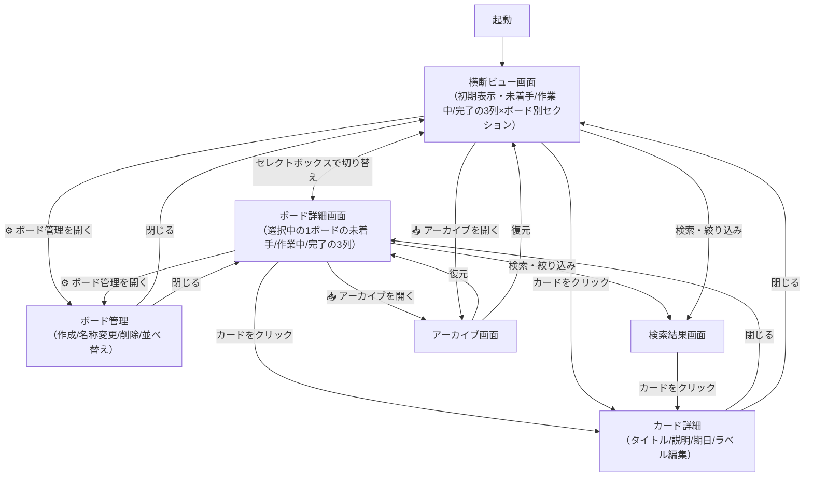

# 画面構成と画面遷移

[← 要件定義書トップへ戻る](../requirements.md)

---

## 6. 画面構成と画面遷移

### 6.1 主要画面一覧

| 画面                   | 役割                                                                                                                                            |
| ---------------------- | ----------------------------------------------------------------------------------------------------------------------------------------------- |
| ボード詳細画面         | 「未着手/作業中/完了」の3列カンバン表示。画面上部のセレクトボックスで表示対象（横断ビュー／各ボード）を切り替える中心画面。初期表示は横断ビュー |
| 横断ビュー画面         | セレクトボックスで「横断ビュー」を選択した状態。「未着手/作業中/完了」の3列は維持したまま、各列の中をボードごとにグループ分けして表示する       |
| ボード管理（モーダル） | ボードの作成・名称変更・削除・並べ替えを行う画面。セレクトボックス脇の管理ボタンから開く                                                        |
| カード詳細（モーダル） | カードのタイトル・説明・期日・ラベルを編集する画面。ボード詳細・横断ビューどちらからも開ける                                                    |
| 検索結果画面           | キーワード・ラベルによる絞り込み結果を表示する画面                                                                                              |
| アーカイブ画面         | アーカイブ済みカードの一覧。復元・完全削除ができる                                                                                              |

### 6.2 画面レイアウト（ワイヤーフレーム）

> **ワイヤーフレームとは？**
> 色・フォント・余白などの見た目の装飾を省き、画面にどんな要素がどう配置されるかだけを示す設計の下書きです。「完成見本」ではなく、要素の配置と大まかな構造を確認するためのものです。
>
> 以下は、[6.1](#61-主要画面一覧)の各画面を**仮に**レイアウトしたものです。実際の色・余白・フォント・ボタンの形状などは、この後の設計フェーズで確定します（[5.3](./02-requirements.md#53-ドラッグドロップによるステータス変更)で「具体的なUIの形状は設計フェーズで決定する」としているのと同じ位置づけです）。

**凡例**

| 記号                   | 意味                                                                                             |
| ---------------------- | ------------------------------------------------------------------------------------------------ |
| `[ボード名 ▾]`      | ボード切り替えセレクトボックス（初期選択＝「すべて」＝横断ビュー）※[5.1](./02-requirements.md#51-ボード管理) |
| `⚙`                 | ボード管理（作成／名称変更／削除／並べ替え）を開く                                               |
| `⠿`                 | ボード管理モーダル内の並べ替えハンドル（ドラッグで並べ替え）                                     |
| `▼`                 | 横断ビュー内でのボード別セクションの見出し                                                       |
| `🔍`                 | 検索                                                                                             |
| `📥`                 | アーカイブ画面を開く                                                                             |
| `🔴`                 | 期限切れ（期日超過）※[5.6](./02-requirements.md#56-期日の強調表示)                               |
| `🟡`                 | 期限間近（前日〜当日）※[5.6](./02-requirements.md#56-期日の強調表示)                             |
| `[ラベル名]`         | ラベル（色付きタグ）※[5.5](./02-requirements.md#55-ラベル管理)                                   |
| `＋`                 | 新規作成（ボード／カード）                                                                       |
| `⋯` / `[移動 ▾]` | カードの操作メニュー（編集／移動／アーカイブ／削除）                                             |

#### ① ボード詳細画面（カンバン）（→ [5.1](./02-requirements.md#51-ボード管理)、[5.2](./02-requirements.md#52-カード管理)、[5.3](./02-requirements.md#53-ドラッグドロップによるステータス変更)）

画面上部のセレクトボックスで表示対象を切り替える中心画面。初期選択は「横断ビュー」（③）で、ここでは「仕事」ボードを選択した状態を示す。「未着手／作業中／完了」の3列を横並びで表示し、列間はドラッグ＆ドロップでカードを移動する（[8.1](./02-requirements.md#81-対象デバイス画面サイズ)）。

```
┌──────────────────────────────────────────────────────────────┐
│ [仕事 ▾]              [⚙][🔍検索][📥アーカイブ]             │
├────────────────────┬────────────────────┬────────────────────┤
│ 未着手 (2)         │ 作業中 (1)         │ 完了 (1)           │
├────────────────────┼────────────────────┼────────────────────┤
│ ┌────────────────┐ │ ┌────────────────┐ │ ┌────────────────┐ │
│ │ 資料作成       │ │ │ 見積書作成     │ │ │ 議事録まとめ   │ │
│ │ 🔴 7/15 [優先] │ │ └────────────────┘ │ └────────────────┘ │
│ └────────────────┘ │                    │                    │
│                    │                    │                    │
│ ┌────────────────┐ │                    │                    │
│ │ 関係者へ連絡   │ │                    │                    │
│ │ 🟡 7/17        │ │                    │                    │
│ └────────────────┘ │                    │                    │
│                    │                    │                    │
│ ＋ カードを追加    │                    │                    │
├────────────────────┴────────────────────┴────────────────────┤
│ ↑ カードをドラッグ＆ドロップで列間を移動できる              │
└──────────────────────────────────────────────────────────────┘
```

スマートフォン表示では3列を縦に積み、1列ずつ確認する。ドラッグ操作に加えて各カードに「移動」ボタンを設け、ボタン操作だけでもステータスを変更できるようにする（[5.3](./02-requirements.md#53-ドラッグドロップによるステータス変更)、[8.1](./02-requirements.md#81-対象デバイス画面サイズ)）。

```
┌──────────────────────────────┐
│ [仕事 ▾]        [⚙][🔍][📥] │
├──────────────────────────────┤
│ [未着手 2]  作業中  完了     │
├──────────────────────────────┤
│ ┌───────────────────────┐    │
│ │ 資料作成              │    │
│ │ 🔴 7/15 [優先]        │    │
│ │           [移動 ▾]    │    │
│ └───────────────────────┘    │
│                              │
│ ┌───────────────────────┐    │
│ │ 関係者へ連絡          │    │
│ │ 🟡 7/17      [移動 ▾] │    │
│ └───────────────────────┘    │
│                              │
│ ＋ カードを追加              │
└──────────────────────────────┘
```

#### ② ボード管理（モーダル）（→ [5.1](./02-requirements.md#51-ボード管理)）

①のセレクトボックス脇にある `⚙` から開く。ボードの新規作成・名称変更・削除、および `⠿` をドラッグしての並べ替えをここで行う。削除時は、所属するカードも削除される旨を確認する（[5.1](./02-requirements.md#51-ボード管理)）。

```
┌─────────────────────────────────────┐
│ ボード管理                     [×] │
├─────────────────────────────────────┤
│ ⠿ 仕事           [改名][削除]       │
│ ⠿ 家事           [改名][削除]       │
│ ＋ ボードを追加                     │
└─────────────────────────────────────┘
```

#### ③ 横断ビュー画面（→ [5.4](./02-requirements.md#54-横断マージビュー)）

①のセレクトボックスで「すべて」（横断ビュー）を選択した状態。**3列（未着手／作業中／完了）は①と同じく最上位の枠組みのまま**、各列の中身を `▼` のボード別セクションで区切って表示する点が①との違い。セレクトボックス上の表示ラベルは「すべて」とし、画面名・機能名としては引き続き「横断ビュー（画面）」「横断マージビュー」と呼ぶ。

```
┌────────────────────────────────────────────────────────┐
│ [すべて ▾]                  [⚙][🔍検索][📥アーカイブ] │
├──────────────┬─────────────┬───────────────────────────┤
│ 未着手       │ 作業中      │ 完了                      │
├──────────────┼─────────────┼───────────────────────────┤
│ ▼ 仕事      │ ▼ 仕事     │ ▼ 仕事                   │
│  資料作成 🔴 │  見積書作成 │  議事録まとめ             │
│              │             │                           │
│ ▼ 家事      │ ▼ 家事     │ ▼ 家事                   │
│  皿洗い      │             │  買い出し 🟡              │
└──────────────┴─────────────┴───────────────────────────┘
```

カードをクリックすれば、元のボードを意識せず④のモーダルを開ける。

#### ④ カード詳細（モーダル）（→ [5.2](./02-requirements.md#52-カード管理)、[5.5](./02-requirements.md#55-ラベル管理)、[5.6](./02-requirements.md#56-期日の強調表示)、[5.7](./02-requirements.md#57-アーカイブ)）

①や③の画面の上に重なって開く（破線の内側が背景画面、実線の枠がモーダル本体）。

```
┌┄┄┄┄┄┄┄┄┄┄┄┄┄┄┄┄┄┄┄┄┄┄┄┄┄┄┄┄┄┄┄┄┄┄┄┄┄┄┄┄┄┄┄┄┄┄┄┐
┊ （背景）ボード詳細画面                        ┊
┊                                               ┊
┊  ┌──────────────────────────────────────────┐ ┊
┊  │ 資料作成                            [×] │ ┊
┊  ├──────────────────────────────────────────┤ ┊
┊  │ ステータス: [未着手 ▾]                   │ ┊
┊  │                                          │ ┊
┊  │ 説明・メモ                               │ ┊
┊  │ ┌─────────────────┐                      │ ┊
┊  │ │ A社向け提案資料 │                      │ ┊
┊  │ └─────────────────┘                      │ ┊
┊  │                                          │ ┊
┊  │ 期日: 🔴 2026/07/15                      │ ┊
┊  │ ラベル: [優先] [社外]  ＋                │ ┊
┊  │                                          │ ┊
┊  │ [アーカイブ] [削除]        [保存]        │ ┊
┊  └──────────────────────────────────────────┘ ┊
┊                                               ┊
└┄┄┄┄┄┄┄┄┄┄┄┄┄┄┄┄┄┄┄┄┄┄┄┄┄┄┄┄┄┄┄┄┄┄┄┄┄┄┄┄┄┄┄┄┄┄┄┘
```

タイトル・ステータス・説明・期日・ラベルを1画面で編集でき、アーカイブ・削除もここから行える。

#### ⑤ 検索結果画面（→ [5.8](./02-requirements.md#58-検索絞り込み)）

```
┌───────────────────────────────────────────┐
│ 🔍[ 資料                                 ] │
├───────────────────────────────────────────┤
│ ▼ 仕事  [優先][社外]                      │
│ ▼ 家事  [急ぎ]                            │
├───────────────────────────────────────────┤
│ 3件ヒット                                 │
│ ┌────────────────────────────────┐        │
│ │ 資料作成      仕事 / 未着手 🔴 │        │
│ └────────────────────────────────┘        │
│ ┌────────────────────────────────┐        │
│ │ 見積書作成    仕事 / 作業中    │        │
│ └────────────────────────────────┘        │
│ ┌────────────────────────────────┐        │
│ │ 買い出し      家事 / 未着手 🟡 │        │
│ └────────────────────────────────┘        │
└───────────────────────────────────────────┘
```

キーワードとラベルの絞り込みを組み合わせて使える。ラベル一覧はボードごとにグループ化して表示する（[5.5](./02-requirements.md#55-ラベル管理)）。アーカイブ済みカードはここには含まれない（[5.8](./02-requirements.md#58-検索絞り込み)）。

#### ⑥ アーカイブ画面（→ [5.7](./02-requirements.md#57-アーカイブ)）

```
┌────────────────────────────────────────────┐
│ アーカイブ                🔍[検索        ] │
├────────────────────────────────────────────┤
│ ┌──────────────────────────────────┐       │
│ │ 議事録まとめ   元: 仕事          │       │
│ │         [復元]        [完全削除] │       │
│ └──────────────────────────────────┘       │
│                                            │
│ ┌──────────────────────────────────┐       │
│ │ 洗濯           元: 家事          │       │
│ │         [復元]        [完全削除] │       │
│ └──────────────────────────────────┘       │
└────────────────────────────────────────────┘
```

完了カードをアーカイブすると①・③の表示からは消え、この画面にのみ残る。各カードから元のボードへの「復元」または「完全削除」ができる。

### 6.3 画面遷移図


