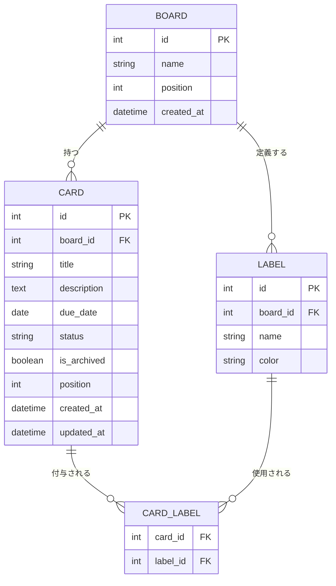

# データモデル

[← 要件定義書トップへ戻る](../requirements.md)

---

## 7. データモデル

### 7.1 ER図（テーブル関連図）

> **ER図とは？**
> データベース内の「テーブル（表）」同士がどう関連しているかを図にしたものです。四角がテーブル、線が関連（つながり方）を表します。

### 7.2 テーブル定義

**BOARD（ボード）**

| カラム     | 型       | 説明           |
| ---------- | -------- | -------------- |
| id         | int (PK) | ボードID       |
| name       | string   | ボード名       |
| position   | int      | 一覧での表示順 |
| created_at | datetime | 作成日時       |

**CARD（カード）**

| カラム                  | 型       | 説明                                                      |
| ----------------------- | -------- | --------------------------------------------------------- |
| id                      | int (PK) | カードID                                                  |
| board_id                | int (FK) | 所属するボードのID                                        |
| title                   | string   | タイトル（必須）                                          |
| description             | text     | 説明・メモ（任意）                                        |
| due_date                | date     | 期日（任意）                                              |
| status                  | string   | `todo`（未着手）/ `doing`（作業中）/ `done`（完了） |
| is_archived             | boolean  | アーカイブ済みかどうか                                    |
| position                | int      | 同一ステータス内での表示順                                |
| created_at / updated_at | datetime | 作成日時・更新日時                                        |

**LABEL（ラベル）**

| カラム   | 型       | 説明                       |
| -------- | -------- | -------------------------- |
| id       | int (PK) | ラベルID                   |
| board_id | int (FK) | 所属するボードのID         |
| name     | string   | ラベル名                   |
| color    | string   | 色（既定パレットから選択） |

**CARD_LABEL（カードとラベルの中間テーブル）**

| カラム   | 型       | 説明     |
| -------- | -------- | -------- |
| card_id  | int (FK) | カードID |
| label_id | int (FK) | ラベルID |

> カードとラベルは「1枚のカードに複数ラベル」「1つのラベルを複数カードに」付けられる**多対多**の関係のため、中間テーブル（CARD_LABEL）で管理します。

### 7.3 設計上の補足

- **リストは独立したテーブルを持たない**：本アプリはリスト（列）を「未着手/作業中/完了」の3種に固定しているため（[2.4](./01-overview.md#24-trello-との違い設計方針)参照）、Trelloのような可変長のリストテーブルは持たず、`CARD.status` の値（`todo`/`doing`/`done`）で状態を表現します。これにより、どのボードでも同じ意味の状態としてカードを比較・集計でき、横断マージビューの実装もシンプルになります。
- **ベーシック認証はサーバー／ホスティング層で完結しアプリ本体には影響しないため、現時点ではユーザーを表すテーブルやカラム（user_id等）は持たせません**（[8.2](./02-requirements.md#82-認証セキュリティ)参照）。将来的に複数ユーザー対応やアプリ本体への認証機能を追加する場合は、各テーブルに `user_id` を追加する形で拡張することを想定しています（[10章](./05-tech-stack-and-roadmap.md#10-今後の拡張ロードマップ)参照）。
