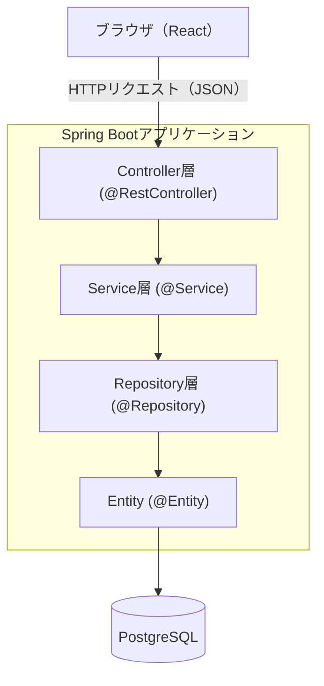

# アーキテクチャ全体像とDI

[← 学習ドキュメントトップへ戻る](./README.md)

> 元の学習ドキュメントにおける **1〜5章** をまとめています。

---

## 1. Spring Bootとは

> **Spring Bootとは？**
> Java言語で作られた「Spring Framework」を土台に、面倒な初期設定を自動化してくれるフレームワークです。Webアプリケーション（今回はREST APIサーバー）を作るための部品（HTTPサーバー、DBアクセス、ルーティングなど）が最初から組み込まれており、最小限のコードで動かし始められます。

Spring Frameworkは非常に多機能な反面、素の状態では設定ファイルの記述量が多く、初心者には敷居が高いという課題がありました。Spring Bootはこれを解消するために作られたプロジェクトで、「設定より規約（Convention over Configuration）」という考え方を採用しています。多くの場合、決まりきったやり方（規約）に従っている限り、個別の設定を書かなくても動くようになっています。

このプロジェクトの`build.gradle`（[7章](./02-build-config.md#7-buildgradle-の読み方)参照）を見ると、`org.springframework.boot`というプラグインが適用されており、これが自動構成の仕組みを有効にしています。

> **Laravelとの対比**
> PHPのLaravelも「Symfony」というフレームワークを土台に、規約を重視して設定の手間を減らしている点でSpring Bootと似た立ち位置です。Laravelの`.env`や`config/`ディレクトリに相当するものが、Spring Bootでは`application.properties`（[8章](./02-build-config.md#8-applicationproperties-の読み方)）です。

---

## 2. レイヤードアーキテクチャ

Spring Bootアプリケーションは、役割ごとに処理を分割する「レイヤードアーキテクチャ（層状の設計）」で実装するのが基本形です。本プロジェクトも将来的にこの形になります。



| 層         | 役割                                                                        | 主なアノテーション                                                                   | 本プロジェクトの状況                                                             |
| ---------- | --------------------------------------------------------------------------- | ------------------------------------------------------------------------------------ | -------------------------------------------------------------------------------- |
| Controller | HTTPリクエストの受け口。URLとメソッド（GET/POST等）に応じて処理を振り分ける | `@RestController`, `@GetMapping` 等                                              | 未実装                                                                           |
| Service    | ビジネスロジック（業務上の処理手順やルール）を担う                          | `@Service`                                                                         | 未実装                                                                           |
| Repository | データベースへのアクセスを担う                                              | `@Repository`（Spring Data JPAでは多くの場合インターフェースを定義するだけでよい） | 未実装                                                                           |
| Entity     | データベースのテーブル1行に対応するクラス                                   | `@Entity`                                                                          | **実装済み**（`Board`/`Card`/`Label`/`CardLabel`/`CardLabelId`） |

それぞれの層が「自分より下の層だけ」を呼び出す一方向の依存にすることで、「画面の都合（Controller）がビジネスロジック（Service）に混ざらない」「DBの都合（Repository）がビジネスロジックに直接漏れ出さない」といった関心の分離ができ、変更に強い設計になります。

> **Laravelとの対比**
>
> | Laravel                         | Spring Boot                                           | 補足                                                                                                                                                         |
> | ------------------------------- | ----------------------------------------------------- | ------------------------------------------------------------------------------------------------------------------------------------------------------------ |
> | `routes/api.php` + Controller | Controller（`@RestController` + `@GetMapping`等） | Laravelはルーティング定義（URL）とControllerクラスが別ファイルですが、Spring Bootは1つのControllerクラスにアノテーションでルーティング情報を直接書きます     |
> | Service（任意で作るクラス）     | Service（`@Service`。明確な層として推奨される）     | 考え方はほぼ同じです                                                                                                                                         |
> | Eloquent Model                  | Entity（`@Entity`）＋ Repository                    | LaravelのModelは「データの形」と「データアクセス」を1つのクラスが兼ねますが、Spring Bootでは Entity（データの形）と Repository（データアクセス）に分離します |

---

## 3. DI（依存性注入）とIoCコンテナ

> **DI（Dependency Injection、依存性注入）とは？**
> クラスが必要とする別のクラスのインスタンスを、自分で`new`して作るのではなく、外部（フレームワーク）が代わりに用意して渡してくれる仕組みです。

例えば、ControllerがServiceを使いたいとき、Controller自身が`new UserService()`のように生成するのではなく、Spring Bootのフレームワークがあらかじめ生成しておいたServiceのインスタンスを、Controllerの生成時に自動的に渡してくれます。この「渡す」動作を注入（Injection）と呼びます。

この仕組みを支えているのが**IoCコンテナ（Inversion of Control、制御の反転コンテナ）**で、Spring Bootでは`ApplicationContext`と呼ばれる部品です。IoCコンテナは、`@Component`・`@Service`・`@Repository`・`@Controller`（`@RestController`）などのアノテーションが付いたクラスをアプリケーション起動時に自動的に見つけ出し（[4章](#4-アプリケーションの起動の仕組み)のコンポーネントスキャン）、インスタンス化して管理します。この管理下に置かれたインスタンスのことを**Bean（ビーン）**と呼びます。

Beanを利用する側（例：Controller）は、コンストラクタの引数に必要なBeanの型を書いておくだけで、IoCコンテナが自動的にそのBeanを見つけて渡してくれます（コンストラクタインジェクション）。これが今後Controller・Serviceを実装する際の基本パターンになります。

```java
// 今後実装するControllerのイメージ（コンストラクタインジェクションの例）
@RestController
public class BoardController {

    private final BoardService boardService;

    // コンストラクタの引数に書くだけで、IoCコンテナが自動でBoardServiceのBeanを渡してくれる
    public BoardController(BoardService boardService) {
        this.boardService = boardService;
    }
}
```

> **Laravelとの対比**
> Laravelの「サービスコンテナ（Service Container）」とほぼ同じ考え方です。ただしPHPは動的型付け言語なので、コンテナへの登録・解決は名前（文字列）や規約ベースで柔軟に行われることが多いのに対し、Javaは静的型付け言語なので、**型（クラス／インターフェース）そのものを手がかりに**Beanが解決される点が異なります。

---

## 4. アプリケーションの起動の仕組み

本プロジェクトの起動クラスは以下のとおりです（`TaskManagementApplication.java`）。

```java
@SpringBootApplication
public class TaskManagementApplication {
	public static void main(String[] args) {
		SpringApplication.run(TaskManagementApplication.class, args);
	}
}
```

> **`TaskManagementApplication.class`とは？（Classリテラル）**
> `SpringApplication.run(TaskManagementApplication.class, args)`の`TaskManagementApplication.class`は、メソッド呼び出しではありません。Javaでは全てのクラスに対し、JVMがそのクラスの構造情報（クラス名・フィールド・メソッド・付与されたアノテーションなど）を保持する`java.lang.Class`という特別なオブジェクトを実行時に1つ生成します。`ClassName.class`と書くと、インスタンスを介さずにこのオブジェクト（型は`Class<TaskManagementApplication>`）を取得できます。`main()`は`static`メソッドなのでこの時点では`TaskManagementApplication`のインスタンスはまだ1つも存在しませんが、`.class`はインスタンスなしで取得できる値なので問題なく書けます。
>
> `SpringApplication.run()`に渡しているのは「自分自身のインスタンス」ではなく「クラスという設計図の情報」です。Spring Bootはこの情報から`@SpringBootApplication`の付与を確認し、このクラスのパッケージ位置（コンポーネントスキャンの基準点）を読み取って、これから構築するアプリケーションの初期化に使います。「自分自身を呼び出す」のではなく、「これから起動処理をする`SpringApplication.run`に、自分の設計図を材料として手渡している」という表現の方が近い動きです。
>
> **Laravelとの対比**：PHPにも似た`SomeClass::class`という構文がありますが、こちらは単に**クラスの完全修飾名を表す文字列**を返すだけです。Javaの`.class`はそれより情報量が多く、メソッド一覧やアノテーション情報まで持つ、リフレクション（実行時にクラス構造を調べる仕組み）可能なオブジェクトを返す点が異なります。

`@SpringBootApplication`は、実は次の3つのアノテーションをまとめたものです。

| アノテーション                                           | 役割                                                                                                                                                                         |
| -------------------------------------------------------- | ---------------------------------------------------------------------------------------------------------------------------------------------------------------------------- |
| `@SpringBootConfiguration`（`@Configuration`の一種） | このクラス自体をSpring Bootの設定クラスとして扱う                                                                                                                            |
| `@EnableAutoConfiguration`                             | クラスパス上の依存関係（`build.gradle`で追加したstarter）を見て、必要な設定を自動的に有効化する（例：`spring-boot-starter-data-jpa`があればJPA関連のBeanを自動構成する） |
| `@ComponentScan`                                       | このクラスと同じパッケージ以下（`com.tkmedia.taskmanagement`配下）を探索し、`@Component`系アノテーションの付いたクラスをすべてBeanとして登録する                       |

`main()`メソッドで`SpringApplication.run(...)`を呼び出すと、おおむね次の順序で処理が進みます。

1. **コンポーネントスキャン**：`@ComponentScan`の対象パッケージ内から`@Component`/`@Service`/`@Repository`/`@RestController`/`@Entity`などが付いたクラスを探し出す
2. **自動構成の適用**：依存関係から「JPAを使うならDataSourceとEntityManagerを用意する」「Web MVCを使うなら組み込みサーバーを用意する」といった設定を自動的に行う
3. **IoCコンテナ（ApplicationContext）の構築**：見つかったクラスをBeanとしてインスタンス化し、依存関係を解決してDIできる状態にする（[3章](#3-di依存性注入とiocコンテナ)）
4. **組み込みサーバーの起動**：`spring-boot-starter-webmvc`により、内蔵のWebサーバー（Tomcat）がポート8080で待ち受けを開始する

`@SpringBootApplication`が付いたクラスをどこに置くかで「どこから下のパッケージがスキャン対象になるか」が決まるため、このクラスは通常パッケージ構成の最上位（本プロジェクトでは`com.tkmedia.taskmanagement`直下）に置きます。

---

## 5. 現状の実装と今後の見取り図

現時点のバックエンドの実装状況は次のとおりです。

| 層 / 要素                    | 状況                           | ファイル                                                      |
| ---------------------------- | ------------------------------ | ------------------------------------------------------------- |
| 起動クラス                   | 実装済み                       | `TaskManagementApplication.java`                            |
| Entity（データの型）         | 実装済み（5種）                | `entity/Board.java` 等（[10〜15章](./03-entity-jpa.md)参照） |
| Repository（データアクセス） | 未実装                         | —                                                            |
| Service（ビジネスロジック）  | 未実装                         | —                                                            |
| Controller（API）            | 未実装                         | —                                                            |
| DTO・バリデーション          | 未実装                         | —                                                            |
| 例外処理                     | 未実装                         | —                                                            |
| テスト（独自ロジック）       | 未実装（`contextLoads`のみ） | `TaskManagementApplicationTests.java`                       |

今後、Repository → Service → Controllerの順で実装が進んでいくと見込まれます。各層を実装した際は、[README.mdの更新ルール](./README.md#このドキュメントの更新ルール)に従って、`04-repository.md`のようにこのドキュメント群にファイルを追加してください。
