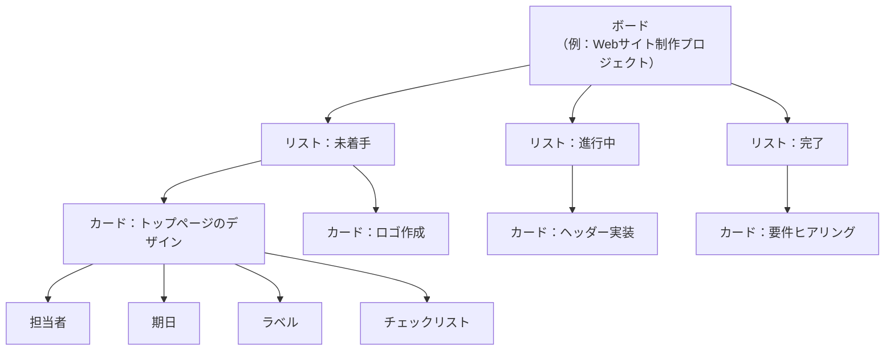
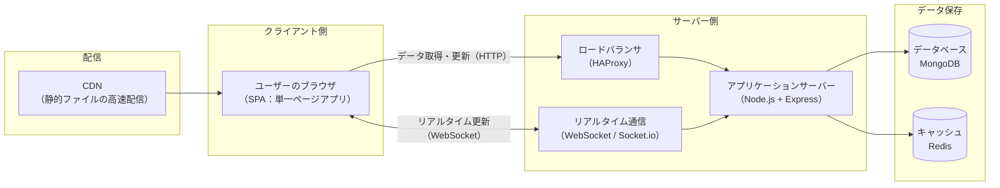

# Trello 事前調査ドキュメント

> このドキュメントは、タスク管理アプリを自作するための事前情報収集としてまとめたものです。
> Trello を使ったことがない人、アプリ開発が初めての人でも理解できるように、専門用語には補足を添えています。

## 目次

1. [はじめに](#1-はじめに)
2. [Trello とは](#2-trelloとは)
3. [基本の3要素：ボード / リスト / カード](#3-基本の3要素ボード--リスト--カード)
4. [カードでできること](#4-カードでできること)
5. [便利な応用機能](#5-便利な応用機能)
6. [料金プラン](#6-料金プラン)
7. [Trello を支える技術スタック](#7-trelloを支える技術スタック)
8. [【橋渡し】自分で似たアプリを作るなら？](#8-橋渡し自分で似たアプリを作るなら)
9. [用語集](#9-用語集)
10. [参考リンク](#10-参考リンク)

---

## 1. はじめに

### このドキュメントの目的

本プロジェクトでは、Trello を参考にしたタスク管理アプリを作成する予定です。
しかし、Trello を使ったことがなく、どんな機能があるのか、どんな技術で作られているのかを知らない状態から始めるため、まず「知る」ことを目的にこのドキュメントを作成しました。

### このドキュメントの読み方

- **2〜6章**：Trello に「どんな機能があるか」をまとめた章です。ここを読めば、Trello を使ったことがなくても大体の使用感がイメージできます。
- **7章**：Trello が「どんな技術で作られているか」をまとめた章です。有名なプロダクトの技術選定を知ることで、自作するときの参考にします。
- **8章**：ここまでの調査を踏まえて、「自分たちで似たアプリを作るならどうするか」の技術的な提案をまとめています。この章は今後の**要件定義書**を作成する際の土台になります。
- **9章**：本文に出てくる専門用語をやさしく解説した用語集です。わからない言葉が出てきたら参照してください。

---

## 2. Trelloとは

Trello（トレロ）は、**カンバン方式**と呼ばれる考え方をベースにした、タスク・プロジェクト管理ツールです。2011年にアメリカの Fog Creek Software 社（現 Trello 社）から生まれ、現在はソフトウェア開発企業 Atlassian（アトラシアン、Jira や Confluence でも有名な会社）が運営しています。

> **カンバン方式とは？**
> 元々はトヨタ自動車の生産管理手法に由来する考え方で、作業を「見える化」し、付箋（カード）を貼った board（板）の上でタスクの状態を管理する手法です。Trello はこれをデジタル化したツールと言えます。

Trello の最大の特徴は、**難しい設定なしに、直感的な操作（ドラッグ＆ドロップ）でタスクの進捗を管理できる**ことです。個人のToDo管理から、数十人規模のチームのプロジェクト管理まで、幅広く使われています。

---

## 3. 基本の3要素：ボード / リスト / カード

Trello の画面構成は、次の3つの要素が入れ子になってできています。

| 要素 | 役割 | 例え |
|---|---|---|
| **ボード（Board）** | プロジェクトやチーム単位の作業スペース全体 | 1冊のノート |
| **リスト（List）** | 進捗の段階（列）でカードを分類する区分 | ノートの中の見出し（章） |
| **カード（Card）** | 個々のタスクやアイデアそのもの | 1つの付箋・ToDo項目 |

典型的な使い方では、リストを「未着手」「進行中」「完了」のように進捗順に並べ、作業が進むごとにカードを右のリストへ**ドラッグ＆ドロップ**で移動させます。この「動かすだけで進捗が更新される」という視覚的な分かりやすさが Trello の人気の理由です。

### データ構造のイメージ図

上図のとおり、「ボード＞リスト＞カード」という3階層の親子関係になっており、さらに各カードにはいくつかの付加情報（属性）を持たせることができます。次の章で、その付加情報について詳しく見ていきます。

### ボードメニュー

ボード画面の右側には「ボードメニュー」という設定用のパネルがあり、以下のような操作をまとめて行えます。

- メンバーの招待・権限管理
- ボード全体の設定変更
- カードの検索・フィルター
- 5章で紹介する Power-Ups（拡張機能）の有効化
- 自動化ルールの作成
- 操作履歴（アクティビティ）の確認

---

## 4. カードでできること

カードは Trello における最小単位のタスクですが、単なる「文字を書いた付箋」ではなく、以下のような多くの情報を1枚に集約できます。

| 項目 | 内容 |
|---|---|
| **担当者（メンバー）** | そのタスクを誰が担当するかをアイコンで表示 |
| **期日（Due Date）** | 締切日時を設定。期限が近づく／過ぎるとカードの色で警告表示される |
| **ラベル** | 色付きのタグ。「バグ」「優先度：高」のようにカードを分類できる |
| **チェックリスト** | カード内にさらに細かいサブタスクの一覧（チェックボックス）を作れる |
| **添付ファイル** | 画像やファイル、外部リンクをカードに添付できる |
| **コメント** | チームメンバー同士でカードに関するやり取りを残せる |
| **カバー画像** | カードの見た目を分かりやすくするための画像・色 |

これらの情報をカード1枚に集約することで、「詳細はカードを開けば全部わかる」という状態を作れるのが Trello の強みです。

---

## 5. 便利な応用機能

基本の3要素（ボード・リスト・カード）に加えて、Trello には作業を効率化するための応用機能が用意されています。初心者はまず知っておく程度で問題ありませんが、「タスク管理ツールに何が求められているか」を知る参考になります。

### Power-Ups（パワーアップ）

**Power-Ups** とは、Trello に後から追加できる拡張機能（プラグインのようなもの）です。250種類以上あり、代表的なものに以下があります。

- **カレンダー Power-Up**：期日のあるカードをカレンダー形式で表示
- **Google Drive / Slack 連携**：外部サービスとの連携
- **タイムライン（ガントチャート）ビュー**：スケジュールを横棒グラフで可視化

### Butler（バトラー）による自動化

**Butler** は、Trello に標準搭載されているノーコード（プログラミング不要）の自動化機能です。例えば以下のようなルールを設定できます。

- 「リストに移動したら」→「自動で担当者を割り当てる」
- 「チェックリストが全部完了したら」→「自動でカードを『完了』リストへ移動する」

これにより、手作業を減らしてタスク管理そのものに集中できるようになります。無料プランでも月250回まで利用可能です。

### 複数のビュー（表示形式）

ボードの標準表示（カンバン形式）以外にも、以下のような見方を切り替えられます。

- **カレンダービュー**：期日ベースでカレンダー表示
- **タイムラインビュー**：ガントチャート形式でスケジュール表示（上位プランの機能）
- **ダッシュボードビュー**：進捗状況をグラフで俯瞰（上位プランの機能）
- **テーブルビュー**：表形式での一覧表示

### その他

- **テンプレート**：よくあるプロジェクト構成をひな形として使い回せる
- **アクティビティ履歴**：誰がいつ何を変更したかのログ

---

## 6. 料金プラン

Trello はフリーミアムモデル（無料でも使えるが、上位機能は有料）を採用しています。以下は2026年時点のおおまかな目安です（正式な金額は必ず [公式の料金ページ](https://trello.com/ja/pricing) で確認してください）。

| プラン | 目安料金 | ボード数 | 自動化（Butler） | 主な特徴 |
|---|---|---|---|---|
| **Free（無料）** | ¥0 | 10枚まで | 月250回まで | カード・メンバーは無制限。個人〜小規模利用に十分 |
| **Standard** | 約 $5 / 月（年払い時） | 無制限 | 月1,000回まで | 高度なチェックリスト、カスタムフィールドなど |
| **Premium** | 約 $10 / 月（年払い時） | 無制限 | 無制限 | タイムライン・ダッシュボードビュー、テーブルビューなど |
| **Enterprise** | 要問い合わせ | 無制限 | 無制限 | 組織全体でのセキュリティ・権限管理など大規模向け |

初心者がまず使う分には **無料プランで十分**な機能が揃っている点も、Trello が広く普及している理由の一つです。

---

## 7. Trelloを支える技術スタック

ここからは「Trello がどんな技術で作られているか」を解説します。Atlassian 公式のエンジニアブログの情報をもとに、初心者にもわかるように噛み砕いて説明します。

> **前提知識**：Webアプリは大きく分けて「フロントエンド（ブラウザに表示される見た目や操作の部分）」「バックエンド（データを処理・保存するサーバー側の部分）」「データベース（データを保存する場所）」で構成されます。

### システム構成図

### フロントエンド（ブラウザ側の技術）

- **SPA（シングルページアプリケーション）** という方式を採用しています。ページ全体を毎回読み込み直すのではなく、必要な部分だけを書き換えることで、サクサク動く操作感を実現しています。
- 開発初期は **Backbone.js**（画面のデータと表示を結びつける仕組み）や **CoffeeScript**（JavaScriptをより簡潔に書くための言語）が使われていましたが、近年は **React** と **TypeScript**（型のあるJavaScript）を用いたモダンな構成に進化しています。
- 表示ファイルは **CDN**（世界中に配置されたサーバーから最も近い場所を経由してファイルを届ける仕組み）から配信され、初回表示が高速になるよう工夫されています。

### バックエンド（サーバー側の技術）

- サーバーには **Node.js** が採用されています。これは「大量のユーザーが同時に接続し続ける」という Trello の特性（後述のリアルタイム通信）に適した、イベント駆動型（何かが起きたときだけ処理をする効率的な方式）のサーバー技術だからです。
- ルーティング（どのURLにアクセスされたらどの処理をするかの振り分け）には **Express** というフレームワークが使われています。

### リアルタイム通信の仕組み

Trello の大きな特徴に「複数人で同時にボードを見ていると、誰かの変更が自分の画面にもすぐ反映される」というものがあります。これは以下の仕組みで実現されています。

- **WebSocket**（ブラウザとサーバーの間に「常時接続の通信路」を作る技術）を使い、変更があったら即座にブラウザへ「プッシュ配信」しています。
- 古いブラウザなど WebSocket が使えない環境向けには、一定間隔でサーバーに問い合わせる **ポーリング**という方式に自動的に切り替える仕組み（フォールバック）も用意されています。

### データベース

- メインのデータベースには **MongoDB**（NoSQL：表形式ではなく、柔軟な構造でデータを保存できるデータベース）が採用されています。1枚のカードの情報をまとめて1つのデータのかたまりとして保存する方式で、高速な読み書きを実現しています。
- **Redis**（メモリ上で高速にデータをやり取りできる仕組み）は、一時的なデータの共有やログイン状態の管理（セッション管理）などに使われています。

### インフラ（土台となる仕組み）

- サーバーはクラウドサービスの **AWS（Amazon Web Services）** 上で稼働しており、利用者数の増減に応じて柔軟にサーバー台数を調整できます。
- **HAProxy** というソフトウェアで、大量のアクセスを複数のサーバーに振り分けています（ロードバランシング）。

### まとめ：なぜこの技術構成なのか

Trello の技術選定に一貫しているのは、「**大勢の人が同時に見ていても、変更がすぐに反映される**」というリアルタイム性を実現するための工夫です。SPA・WebSocket・Node.js・MongoDB はいずれも、この「即時性」と「同時接続数の多さ」に強い技術という共通点があります。

---

## 8. 【橋渡し】自分で似たアプリを作るなら？

ここからは、これまでの調査を踏まえて、**初心者が自作する場合の技術的な選択肢**を提案します。あくまで一つの案であり、実際の技術選定は今後作成する要件定義書の中で改めて検討してください。

### 初心者にもおすすめしやすい技術スタック例

Trello と全く同じ技術（Node.js + MongoDB + WebSocket…）を使う必要はありません。学習のしやすさや情報の多さを重視すると、以下のような構成が候補になります。

| 役割 | Trello の技術 | 初心者向けの代替候補 | 選定理由 |
|---|---|---|---|
| フロントエンド | React | **React** または **Next.js** ＋ TypeScript | 学習情報が豊富。TypeScriptで型の恩恵を受けられる |
| ドラッグ＆ドロップ | 独自実装 | 既存のライブラリ（例：`dnd kit` 等） | カード移動のようなUIを自前実装せず楽に導入できる |
| バックエンド | Node.js + Express | **Node.js** or **BaaS**（Supabase, Firebase等） | BaaSを使えばサーバー構築の知識がなくてもDB・認証機能を使える |
| データベース | MongoDB + Redis | **PostgreSQL** や **Firestore** など | まずは正規化されたリレーショナルDBの方が構造を理解しやすい場合が多い |
| リアルタイム通信 | WebSocket(Socket.io) | 必要になった段階で導入を検討 | 最初のうちは必須ではなく、後回しにできる機能 |

> **BaaS（Backend as a Service）とは？**
> サーバーやデータベースの構築・運用を意識せずに使える、バックエンドの機能をまとめて提供してくれるサービスのことです（例：Supabase、Firebase）。個人開発や初心者にも扱いやすいのが特徴です。

### 最初に作るべき最小構成（MVP）の考え方

Trello には非常に多くの機能（Power-Ups、Butler自動化、複数ビューなど）がありますが、**最初から全部を真似する必要はありません**。以下のような優先順位で考えるとよいでしょう。

1. **最優先（MVP：Minimum Viable Product = 実用最小限の製品）**
   - ボードを1つ作成できる
   - リストを追加・編集・削除できる
   - カードを追加・編集・削除できる
   - カードをドラッグ＆ドロップでリスト間移動できる
2. **次の段階**
   - カードに期日・担当者・ラベルを設定できる
   - チェックリスト機能
   - 複数ボードの管理、メンバー招待
3. **余裕があれば**
   - Power-Ups的な外部連携
   - Butlerのような自動化ルール
   - カレンダー／タイムラインなどの複数ビュー

この「1→2→3」の順番で機能をピックアップしていくことで、次に作成する要件定義書がスコープを絞った現実的なものになります。

---

## 9. 用語集

| 用語 | 意味 |
|---|---|
| **カンバン方式** | 作業を「見える化」し、板（ボード）の上でタスクの状態を管理する手法。Trelloのボード/リスト/カードの原型となる考え方 |
| **SPA（シングルページアプリケーション）** | ページ全体を再読み込みせず、必要な部分だけ書き換えて動作するWebアプリの作り方 |
| **フロントエンド** | ブラウザに表示される見た目や、ユーザーが直接操作する部分 |
| **バックエンド** | データの処理・保存を担う、サーバー側の仕組み |
| **API** | アプリ同士がデータをやり取りするための「窓口」となる仕組み |
| **WebSocket** | ブラウザとサーバーの間に常時接続の通信路を作り、リアルタイムにデータをやり取りする技術 |
| **ポーリング** | 一定間隔でサーバーに「変化はありましたか？」と問い合わせる通信方式 |
| **NoSQL** | 表形式（行と列）にとらわれず、柔軟な形式でデータを保存できるデータベースの総称（例：MongoDB） |
| **セッション管理** | ユーザーのログイン状態などを一時的に保持・管理する仕組み |
| **CDN** | 世界中に配置したサーバーを経由してファイルを高速に配信する仕組み |
| **ロードバランシング** | 大量のアクセスを複数のサーバーに分散させる仕組み |
| **BaaS** | サーバー構築を意識せずに使える、バックエンド機能一式を提供するサービス |
| **MVP（Minimum Viable Product）** | 実用に足る最小限の機能だけを備えた製品・試作版 |

---

## 10. 参考リンク

- [Trello 技術スタック解説（Atlassian公式ブログ）](https://www.atlassian.com/blog/trello/the-trello-tech-stack)
- [Trello 初級編：ボードおよびカードの使用方法（Trello公式ガイド）](https://trello.com/ja/guide/trello-101)
- [Trello 料金プラン（公式）](https://trello.com/ja/pricing)
- [Trello の自動化（Butler公式ページ）](https://trello.com/ja/butler-automation)
- [カレンダー Power-Up を使用する（Atlassianサポート）](https://support.atlassian.com/ja/trello/docs/using-the-calendar-power-up/)
- [自動化の割り当てと制限（Atlassianサポート）](https://support.atlassian.com/ja/trello/docs/butler-quotas-and-limits/)

---

*本ドキュメントは今後、要件定義書を作成する際の土台資料として利用する想定です。機能のピックアップや技術選定は、このドキュメントの内容を参考にしつつ、プロジェクトの目的に合わせて改めて検討してください。*
